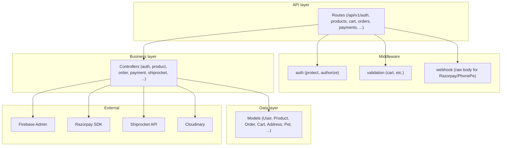
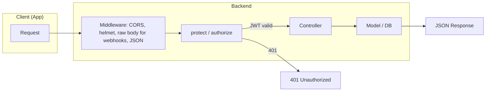
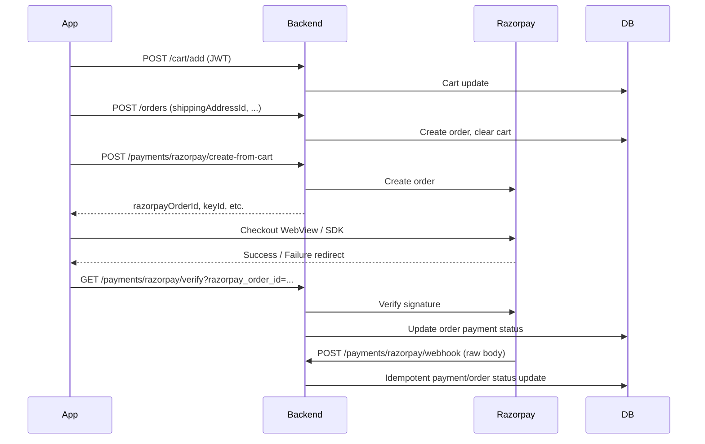

# Marshee Marketplace Backend – Software Architecture Document  
## High-Level Design (HLD)

**Document version:** 1.0  
**Audience:** Product, Engineering, Mobile/Frontend teams  
**Status:** Living document  
**Companion:** Aligns with MyApp (Marshee) App HLD for combined architecture view

---

## Summary

**Marshee Marketplace Backend** is a Node.js/Express REST API that powers the MyApp (Marshee) mobile app for **auth** (Firebase OTP verify + JWT, email OTP registration), **e-commerce** (products, categories, brands, cart, checkout, orders), **payments** (Razorpay, PhonePe), **shipping** (Shiprocket), **user profiles**, **pets**, **addresses**, **wishlist**, **coupons**, **services**, **pre-orders**, **Woggle pre-orders**, and **analytics**. It uses **MongoDB** as the primary store, **Firebase Admin** to verify phone OTP, **Razorpay/PhonePe** for payments (with webhooks), **Shiprocket** for fulfillment, and **Cloudinary** for product images. This document describes the high-level architecture, API modules, external integrations, data flows, security, and how it maps to the app HLD for a combined view.

---

## Table of Contents

| # | Section |
|---|---------|
| 1 | [Introduction](#1-introduction) |
| 2 | [System Overview](#2-system-overview) |
| 3 | [Architecture Diagrams](#3-architecture-diagrams) |
| 4 | [External Systems and Integrations](#4-external-systems-and-integrations) |
| 5 | [Module Overview](#5-module-overview) |
| 6 | [Data Flow](#6-data-flow) |
| 7 | [Security and Authentication](#7-security-and-authentication) |
| 8 | [Non-Functional Requirements](#8-non-functional-requirements) |
| 9 | [Technology Stack](#9-technology-stack) |
| 10 | [Deployment](#10-deployment) |
| 11 | [App–Backend Mapping (Combined View)](#11-appbackend-mapping-combined-view) |
| 12 | [Glossary](#12-glossary) |
| 13 | [Document References](#13-document-references) |

---

## 1. Introduction

### 1.1 Purpose

This document describes the **high-level design and software architecture** of the Marshee Marketplace Backend. It is intended for:

| Audience | Use |
|----------|-----|
| **Product** | Backend scope, API boundaries, and integration points. |
| **Engineering** | API modules, auth, payments, shipping, and tech stack. |
| **Mobile/Frontend** | Which backend APIs and flows support each app feature. |

### 1.2 Scope

| In scope | Out of scope |
|----------|--------------|
| REST API (routes, controllers, models) | Fitness backend (separate service) |
| Auth, marketplace, orders, payments, shipping | Community / chat (if present, separate or future) |
| External systems (Firebase, Razorpay, Shiprocket, etc.) | Low-level API contracts (LLD / OpenAPI details) |
| Non-functional requirements | Runbooks and infra playbooks |

---

## 2. System Overview

### 2.1 Backend Capabilities

| Area | Description |
|------|-------------|
| **Auth** | Firebase OTP verify → JWT; email OTP registration; login; profile; partner password setup; admin/partner roles. |
| **Commerce** | Products (CRUD, approval, search, by category); categories (super/service/sub); brands; cart; coupons; wishlist; orders (create, list, detail, cancel, status, payment status); addresses. |
| **Payments** | Razorpay (create-from-cart, verify, webhook); PhonePe (initiate, callback, webhook); pre-order and Woggle pre-order payments. |
| **Shipping** | Shiprocket: login, serviceability, create order, cancel, AWB assign, pickup, track. |
| **Services** | Service catalog (CRUD, search, nearby, by type/category); cart can include services. |
| **Pre-orders** | Pre-order form CRUD; Woggle pre-order + payment + webhook. |
| **Pets & Profile** | Pet CRUD; user profile and addresses (shipping/billing). |
| **Partners** | Partner application, approve/reject, pickup locations; product submission by partner. |
| **Analytics** | Dashboard, product, order, sales, category, partner analytics (role-protected). |

### 2.2 Key Attributes

| Attribute | Value |
|-----------|--------|
| **API style** | REST, JSON; base path `/api/v1/`. |
| **Auth** | JWT (Bearer / cookie / x-access-token); Firebase Admin for OTP verify. |
| **Database** | MongoDB (Mongoose). |
| **Integrations** | Firebase Auth, Razorpay, PhonePe, Shiprocket, Cloudinary. |
| **Docs** | Swagger at `/api-docs`. |

---

## 3. Architecture Diagrams

### 3.1 System Context (C4 – Level 1)

Shows the backend and all external systems it interacts with.

```mermaid
C4Context
    title System Context - Marshee Marketplace Backend
    person(user, "Pet Owner", "Uses the app")
    system(api, "Marshee Backend", "REST API - Marketplace, auth, orders, payments, shipping")
    system_ext(mongo, "MongoDB", "Primary database")
    system_ext(firebase, "Firebase Auth", "Verify phone OTP")
    system_ext(razorpay, "Razorpay", "Payments + webhooks")
    system_ext(phonepe, "PhonePe", "Payments + webhooks")
    system_ext(shiprocket, "Shiprocket", "Shipping, AWB, tracking")
    system_ext(cloudinary, "Cloudinary", "Product images")
    system_ext(smtp, "SMTP", "Email OTP, partner emails")
    rel(user, api, "Uses via App")
    rel(api, mongo, "Read/Write")
    rel(api, firebase, "Verify ID token")
    rel(api, razorpay, "Create order, verify, webhook")
    rel(api, phonepe, "Initiate, callback, webhook")
    rel(api, shiprocket, "Login, orders, AWB, track")
    rel(api, cloudinary, "Upload images")
    rel(api, smtp, "Send email")
```

### 3.2 Container View – Backend Layers

High-level structure inside the backend.



### 3.3 Request Flow and Auth



### 3.4 Commerce and Payment Flow



---

## 4. External Systems and Integrations

| System | Role | Used by |
|--------|------|--------|
| **MongoDB** | Primary database (users, products, orders, cart, addresses, pets, etc.). | All models via Mongoose |
| **Firebase Admin** | Verify Firebase ID token (phone OTP); used in `firebaseOtpVerify` and `firebaseAuth` (token exchange). | auth.controller |
| **Razorpay** | Create payment order, verify payment (callback), webhook (signature verification with raw body). | payment.controller, config/razorpayConfig.js |
| **PhonePe** | Initiate payment, callback, webhook (raw body). | payment.controller, test.controller |
| **Shiprocket** | Login (token), serviceability, create/cancel order, AWB assign, pickup, track. | shiprocket.controller, utils/shiprocket.* |
| **Cloudinary** | Product image upload (via multer + cloudinary config). | product.controller, config/cloudinary*.js |
| **SMTP** | Send OTP and partner emails (nodemailer). | auth.controller, utils/emailService.js |

---

## 5. Module Overview

### 5.1 API Route Summary

| Prefix | Purpose | Auth |
|--------|---------|------|
| `/api/v1/auth` | Register, verify OTP, login, Firebase token/OTP verify, profile, delete account, partner password setup | Mixed (public + protect + authorize) |
| `/api/v1/products` | CRUD, list, search, by category, approval (admin), dashboard (partner/admin) | Mixed |
| `/api/v1/categories` | Super / service / sub category CRUD, hierarchy | Mixed |
| `/api/v1/brands` | CRUD, list, my brands (partner/admin) | Mixed |
| `/api/v1/partners` | Create, list, apply, approve/reject, stats, pickup locations | Mixed |
| `/api/v1/coupons` | Create, list, validate (cart apply) | Mixed |
| `/api/v1/cart` | Get, add, update, remove, clear, apply/remove coupon, add/update/remove service | protect |
| `/api/v1/wishlist` | Get, add, remove | protect |
| `/api/v1/orders` | Create, list, get by id, tracking, cancel; admin: all, status, payment status | protect (+ authorize for admin) |
| `/api/v1/pets` | CRUD pets | protect |
| `/api/v1/payments` | Razorpay/PhonePe create, verify, webhooks; pre-order payments | protect for create; no auth for webhooks/verify callback |
| `/api/v1/services` | CRUD, search, nearby, by type/category | Mixed |
| `/api/v1/addresses` | CRUD, list, billing | protect |
| `/api/v1/survey` | Submit, list, analytics, by email | Public / mixed |
| `/api/v1/preOrder` | Pre-order form CRUD, stats | Mixed |
| `/api/v1/woggle` | Woggle pre-order CRUD, payment create/verify/webhook | Mixed |
| `/api/v1/shiprocket` | Login, serviceability, orders create/cancel, AWB, pickup, track | Often with Shiprocket token or env |
| `/api/v1/analytics` | Dashboard, products, orders, sales, categories, partners | protect, authorize(partner, admin) |

### 5.2 Main Models (Data Entities)

| Model | Purpose |
|-------|---------|
| User | name, email, phoneNumber, role (user/partner/admin), password, firebaseUID |
| Pet | Linked to user; pet profile data |
| Address | User addresses (shipping/billing), isDefault, isDeleted |
| Product | Catalog product (variants, inventory, category, brand, partner, status, ratings, etc.) |
| Variant | Embedded in Product; price, stock, SKU |
| Category | SuperCategory, ServiceCategory, SubCategory (hierarchy) |
| Brand | Brand entity; partner/admin create |
| Partner | Partner profile; linked to user; approval status; pickup locations |
| Cart | user, items (product/variant or service), subtotal, coupon |
| Coupon | code, discount, validity, usage rules |
| Order | user, items, shipping/billing address, payment, status, Shiprocket refs |
| Wishlist | user, products |
| Service | Service catalog (type, category, location, etc.) |
| PreOrderForm | Pre-order form submissions |
| WogglePreOrder | Woggle pre-order flow |
| Otp | Email OTP for registration (and similar) |

### 5.3 Cross-Cutting Concerns

| Concern | Implementation |
|---------|----------------|
| **Auth** | JWT in `Authorization: Bearer`, cookie `token`, or `x-access-token`. Middleware `protect` loads user; `authorize(...roles)` checks role. |
| **Webhooks** | Routes under `/razorpay/webhook`, `/phonepe/webhook` use raw body middleware (preserveRawBody) before JSON parser for signature verification. |
| **Errors** | Central error middleware; ErrorResponse with statusCode; 404 for unknown routes. |
| **Docs** | Swagger at `/api-docs` (config/swagger.js). |

---

## 6. Data Flow

### 6.1 Auth and Session

| Step | Flow |
|------|------|
| 1 | **Firebase OTP (app)** → App gets Firebase ID token → `POST /api/v1/auth/firebase-otp-verify` with `Authorization: Bearer <idToken>`. |
| 2 | Backend verifies ID token with Firebase Admin; finds or creates user by firebaseUID/phoneNumber; issues JWT. |
| 3 | **Email registration** → `POST /api/v1/auth/register` (name, email, password) → OTP sent via email → `POST /api/v1/auth/verify-registration-otp` (email, otp) → user created, JWT returned. |
| 4 | **Login** → `POST /api/v1/auth/login` (email, password) or `POST /api/v1/auth/token` (firebaseUID, phoneNumber, timestamp) → JWT returned. |
| 5 | Protected routes send JWT; `protect` middleware verifies JWT and attaches `req.user`. |

### 6.2 Commerce (Cart → Order → Payment)

| Step | Flow |
|------|------|
| 1 | Add to cart: `POST /api/v1/cart/add` (product/variant, quantity) → Cart updated. |
| 2 | Checkout: `POST /api/v1/orders` (shippingAddressId, billingAddressId, paymentMethod, couponCode, notes) → Stock checked, coupon applied, order created, cart cleared. |
| 3 | Payment: `POST /api/v1/payments/razorpay/create-from-cart` → Razorpay order created; app opens Razorpay; on success app calls `GET /api/v1/payments/razorpay/verify?razorpay_order_id=...&razorpay_payment_id=...&razorpay_signature=...` → Backend verifies signature, updates order payment status. |
| 4 | Webhook: Razorpay sends `POST /api/v1/payments/razorpay/webhook` (raw body) → Backend verifies signature, updates order/payment idempotently. |

### 6.3 Shipping (Shiprocket)

| Step | Flow |
|------|------|
| 1 | Backend (or app-triggered flow) calls Shiprocket login → token. |
| 2 | Serviceability check → create order → assign AWB → request pickup → track by AWB. |
| 3 | Order model holds Shiprocket order_id, AWB, etc.; tracking exposed via `GET /api/v1/orders/:id/tracking`. |

---

## 7. Security and Authentication

| Aspect | Design |
|--------|--------|
| **Identity** | Firebase phone OTP verified via Firebase Admin; email OTP for registration. Backend issues JWT (config.jwtSecret, jwtExpire). |
| **API access** | JWT required for protected routes (Bearer / cookie / x-access-token). 401 when missing or invalid. |
| **Roles** | user, partner, admin. `authorize('admin')` or `authorize('partner', 'admin')` for admin/partner-only routes. |
| **Webhooks** | Razorpay/PhonePe webhooks use raw body and signature verification; no JWT. |
| **Secrets** | JWT secret, Razorpay/PhonePe keys and webhook secrets, Firebase service account, Shiprocket credentials, SMTP, Cloudinary from env (e.g. .env). |

---

## 8. Non-Functional Requirements

### 8.1 Performance

| ID | Requirement | Notes |
|----|-------------|--------|
| NFR-P1 | API responds within acceptable latency for list/detail endpoints. | Indexes on Product, Order, Cart, User; pagination where used. |
| NFR-P2 | Webhook handlers verify signature and persist without blocking. | Raw body parsed once; idempotent updates. |

### 8.2 Security

| ID | Requirement | Notes |
|----|-------------|--------|
| NFR-S1 | All protected routes require valid JWT. | protect middleware. |
| NFR-S2 | Webhook endpoints verify gateway signature. | Razorpay/PhonePe signature verification with raw body. |
| NFR-S3 | Secrets and keys from environment. | config from process.env; no hardcoded production secrets. |

### 8.3 Availability and Resilience

| ID | Requirement | Notes |
|----|-------------|--------|
| NFR-A1 | Server starts even if MongoDB is temporarily unreachable (e.g. Cloud Run). | connectDB catch; no process.exit in production. |
| NFR-A2 | Health check for load balancer. | GET /health returns 200 and timestamp. |

### 8.4 Maintainability and Observability

| ID | Requirement | Notes |
|----|-------------|--------|
| NFR-M1 | Single codebase; layered structure (routes → controllers → models). | Express, modular routes and controllers. |
| NFR-M2 | API documentation. | Swagger at /api-docs. |

---

## 9. Technology Stack

| Layer | Technology |
|-------|------------|
| **Runtime** | Node.js |
| **Framework** | Express |
| **Database** | MongoDB (Mongoose) |
| **Auth** | jsonwebtoken (JWT), bcryptjs, firebase-admin |
| **Payments** | razorpay SDK; PhonePe (axios/HTTP) |
| **Shipping** | Shiprocket (axios/HTTP; utils/shiprocket.*) |
| **Images** | multer, cloudinary |
| **Email** | nodemailer |
| **Security** | helmet, cors, compression |
| **Docs** | swagger-jsdoc, swagger-ui-express |
| **Config** | dotenv, config.js |

---

## 10. Deployment

| Aspect | Description |
|--------|-------------|
| **Process** | Listen on PORT (default 5000), host 0.0.0.0. |
| **Database** | MongoDB URI from env (MONGODB_URI; optional fallbacks). |
| **Environment** | .env for secrets and feature flags; NODE_ENV for development/production. |
| **Cloud** | Designed to run on Cloud Run or similar (server starts without waiting for DB). |

---

## 11. App–Backend Mapping (Combined View)

Use this section to combine with the **MyApp (Marshee) App HLD**.

### 11.1 System Context – Combined

```mermaid
C4Context
    title Combined System Context - MyApp + Marshee Backend
    person(user, "Pet Owner", "Uses the app and tracker")
    system(app, "MyApp", "React Native app (iOS & Android)")
    system(be, "Marshee Backend", "Marketplace, auth, orders, payments, shipping")
    system_ext(firebase, "Firebase Auth", "Phone OTP")
    system_ext(fitness_be, "Fitness Backend", "Sessions, metrics")
    system_ext(razorpay, "Razorpay", "Payments")
    system_ext(tracker, "BLE Pet Tracker", "Firmware device")
    system_ext(mongo, "MongoDB", "Backend DB")
    rel(user, app, "Uses")
    rel(app, firebase, "OTP send/verify")
    rel(app, be, "REST API (JWT)")
    rel(app, fitness_be, "REST API")
    rel(app, razorpay, "Checkout WebView")
    rel(app, tracker, "BLE")
    rel(be, mongo, "Read/Write")
    rel(be, firebase, "Verify ID token")
    rel(be, razorpay, "Create order, verify, webhook")
```

### 11.2 Feature-to-API Mapping

| App module / flow | Backend APIs (this repo) | Notes |
|-------------------|--------------------------|--------|
| **Auth** | POST /auth/firebase-otp-verify, POST /auth/token, GET /auth/me, PUT /auth/profile, POST /auth/register, POST /auth/verify-registration-otp, POST /auth/login | JWT returned by backend after Firebase or email verify. |
| **Home / Marketplace** | GET /products, GET /products/:id, GET /categories/*, GET /brands | Catalog and filters. |
| **Cart** | GET/POST/PUT/DELETE /cart/*, POST /cart/apply-coupon | Cart and coupons. |
| **Checkout** | POST /orders (create), POST /payments/razorpay/create-from-cart, GET /payments/razorpay/verify | Order creation then payment; verify on success. |
| **Orders** | GET /orders, GET /orders/:id, GET /orders/:id/tracking, POST /orders/:id/cancel | List, detail, tracking. |
| **Addresses** | GET/POST/PUT /addresses, GET /addresses/billing | Shipping/billing for checkout. |
| **Wishlist** | GET /wishlist, POST/DELETE /wishlist | Wishlist. |
| **Pets** | CRUD /pets | Pet profiles. |
| **Profile** | GET /auth/me, PUT /auth/profile | User profile. |
| **Fitness / BLE** | — | **Fitness Backend** (separate); device–pet linkage may call this backend (partners/pets) if needed. |
| **Community / Chat** | — | Not in this backend; separate service or future. |
| **Training / VetConnect** | GET /services* | Services catalog; no dedicated training/VetConnect APIs in this doc. |

### 11.3 Data Direction – App ↔ Backend

| Direction | Content |
|-----------|--------|
| App → Backend | JWT (Bearer header); REST body (JSON); multipart for uploads. |
| Backend → App | JSON (user, products, cart, order, payment result, addresses, pets, etc.). |
| Backend → Razorpay/PhonePe | Create order; verify; receive webhooks. |
| Backend → Firebase | Verify ID token only. |

---

## 12. Glossary

| Term | Definition |
|------|------------|
| **JWT** | JSON Web Token; issued after Firebase OTP verify or email OTP/login; used as Bearer token for API calls. |
| **protect** | Middleware that validates JWT and attaches req.user; returns 401 if missing/invalid. |
| **authorize(roles)** | Middleware that checks req.user.role against allowed roles; returns 403 if not allowed. |
| **Raw body** | Unparsed request body buffer; required for Razorpay/PhonePe webhook signature verification. |
| **Shiprocket** | Third-party shipping provider; login, create order, AWB, pickup, track. |
| **Woggle** | Pre-order product/program with its own payment and webhook flow. |

---

## 13. Document References

| Document | Description |
|----------|-------------|
| **MyApp (Marshee) – Software Architecture Document (App HLD)** | Mobile app architecture; combine with this doc for full system view. |
| **Swagger** | `/api-docs` – API endpoints and request/response shapes. |
| **README.md** | Project setup and run instructions. |
| **RAZORPAY_*.md, SHIPROCKET_*.md** | Payment and shipping verification details. |
